# 自动机的状态转换图表示

### 设计的要求

- 要求设计一个具有绘图功能的程序，可以手工以状态转换图的方式绘制自动机；
- 图形化的自动机可以保存，读取；
- 根据状态转换图得出自动机的状态转换矩阵；
- 根据状态转换矩阵，自动绘制出状态转换图;
- 程序可以自动调整状态转换图到一个比较美观的状态;

### 开发环境

- Manjaro Linux(内核版本5.9.11)操作系统
-  Qt Creator 4.13.3
- QMake版本为 3.1，GCC版本为10.2.0

### 概要设计

打开软件，通过侧边栏选择模式，可选模式有五种，分别是移动，添加点，添加边，删除，修改，通过鼠标点击切换想用的模式。各模式功能如下：

- 移动：鼠标单击图上的点（对应状态），长按不松手，移动鼠标，点会跟随鼠标移动，与之相连的边自动调整。
- 添加点：在图中一个位置单击鼠标，弹出提示框，输入点名称（状态名）及是否是初态/终态，点击确认后，该位置新增一个点。
- 添加边：连续点击两个点A，B，弹窗提示输入边的信息（输入符号），点击确认后增加一条边，A，B可以是同一个点，添加自环。
- 删除：鼠标点击边则删除边，点击点则删除点和与它相连的所有边。
- 修改：鼠标点击边或者点，弹出对应添加状态中出现的弹窗，在弹窗中修改信息即可。

按键功能：

- 减号：缩小图形
- 加号或等号（一般键盘上加号与等号在同一个按键上）：放大图形
- 空格：随机打乱点的位置
- 鼠标滚轮：也可以放大缩小图形

自动调整：
- 此功能可以自动调整点的位置，使图形比较自然，实现方法参考了Qt的官方文档中的 Elastic Nodes Example，核心算法是每个点间有斥力，与点到点的距离平方成正比，边有拉力，与边长的平方成正比。设置定时器，每隔一段时间计算每个点的受力情况，更新点的位置，当受力平衡时，图是舒展开的，较美观。
- 自定义实现了继承QGraphicsItem的Node类和Edge类，其中保存了点/边信息，比如点的名字，位置，边的起点，终点，注释（输入符号）等，并实现了绘制等相关功能。继承QGraphicsView的GraphWidget实现了对Node和Edge的管理，大部分交互响应（比如按键功能，添加点/边等）也是它实现的。

### 系统的类图

画出系统的所包括的所有类及类之间的关系图。

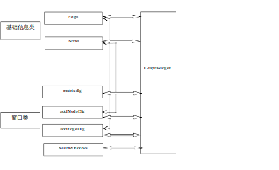

### 主要算法的流程图

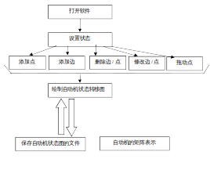

### 数据分析与定义

| Node        | 继承自QGraphicsItem                                |                                                           |
| ----------- | -------------------------------------------------- | --------------------------------------------------------- |
|             | QVector<Edge *> edgeList;                          | 记录与该点相连的所有边                                    |
|             | static QVector<Node*>nodeList;                     | 记录全局所有点                                            |
|             | void  Node::paint(QPainter  *painter...)           | 画出点（状态）                                            |
|             | QString  m_nodeName;                               | 二进制的最低位代表是初态 		二进制的低二位代表是终态 |
|             | QString  m_nodeName;                               | 点（状态）的名称                                          |
|             | void  calculateForces();                           | 自动调整需要，计算点受力                                  |
|             | bool  advancePosition();                           | 自动调整需要，应用新座标                                  |
| Edge        | 继承自QGraphicsItem                                |                                                           |
|             | Node  *source, *dest;                              | 边的起点，终点                                            |
|             | QString  inputList;                                | 边的注释（输入符号）                                      |
|             | QString reInputList;                               | 反向边的注释（输入符号），可能为空                        |
|             | QPointF sourcePoint，destPoint;                    | 边的端点的位置                                            |
|             | void adjust()                                      | 图有变化后更新边                                          |
|             | void paint(QPainter *painter...)                   | 画出边                                                    |
| GraphWidget | 继承自QGraphicsView                                |                                                           |
|             | int  mode;                                         | 对应移动，添加点，添加边，删除，修改，5个模式             |
|             | bool  autoAdjust ;                                 | 是否开启自动调整                                          |
|             | void mousePressEvent(QMouseEvent *event) override; | 响应鼠标点击事件，是本类的关键函数                        |

### 测试方法和测试结果

#### 测试用例1

测试目的：测试绘制自动机状态图

设置状态为添加点，点击绘图区一个地方，弹出窗口

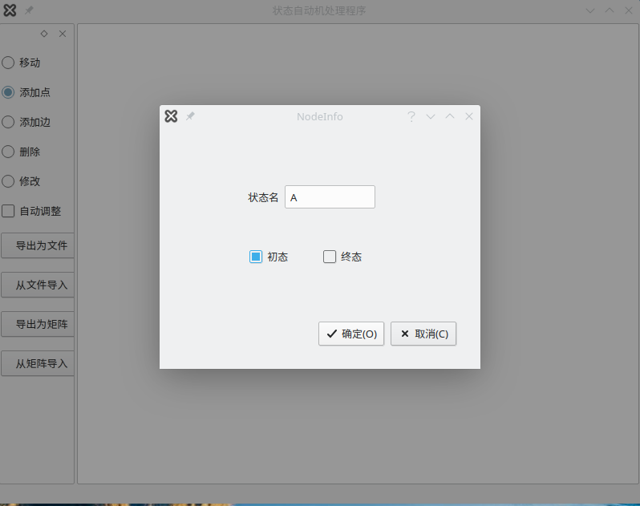

输入状态信息后显示如下：

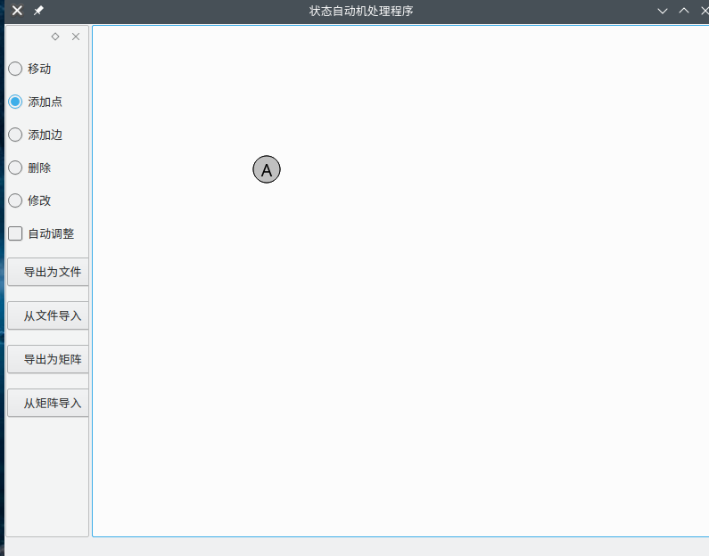

点击另一处地方，添加B点

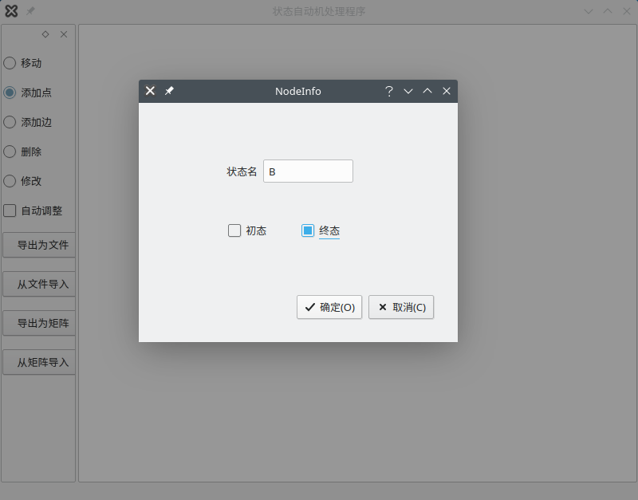

点击确认后显示如下：

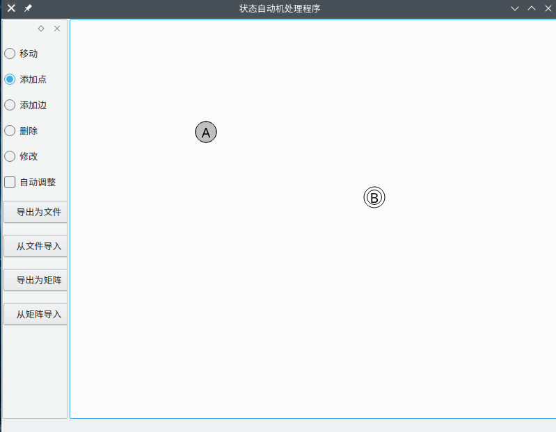

用同样的方法添加更多的点

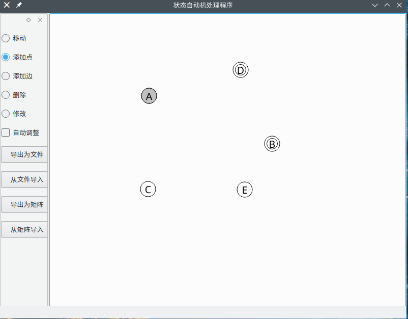

状态切换到添加边，点击A点和D点，输入A到D的边

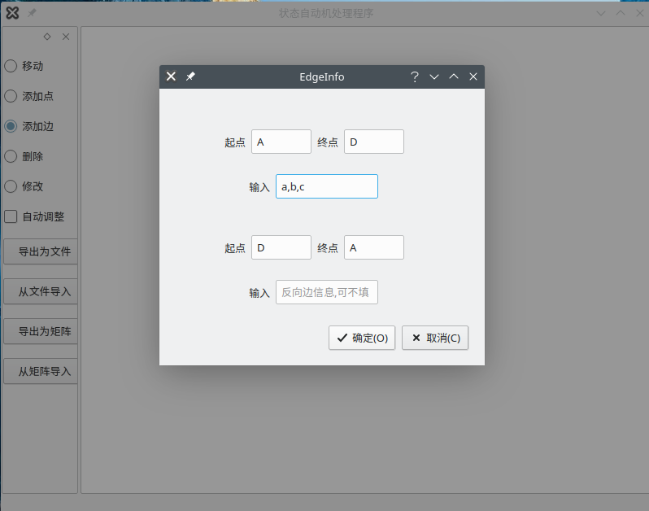

点击确定后，显示如下

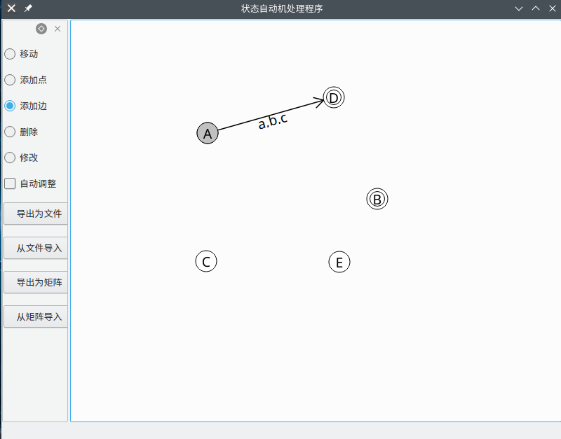

继续添加其他边

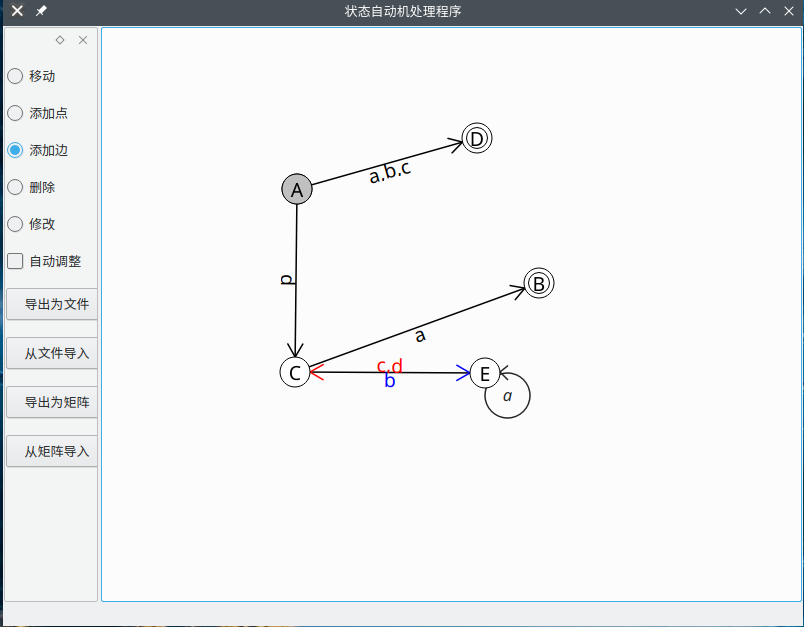

#### 测试用例2

测试目的：测试状态图与文件的转换

点击侧边栏“导出为文件”按钮，输入文件名

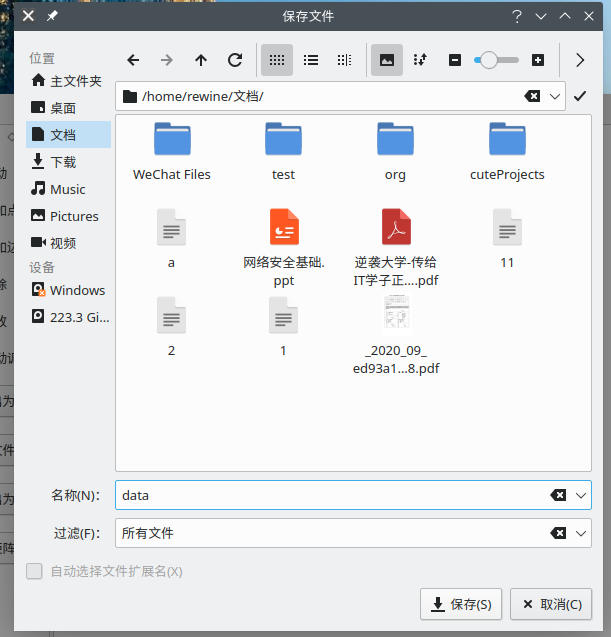

重新打开程序后失去数据，点击“从文件导入”按钮，打开上次保存的文件

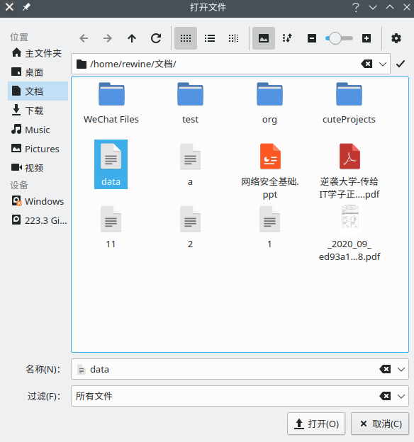

点击确认后，数据恢复如下

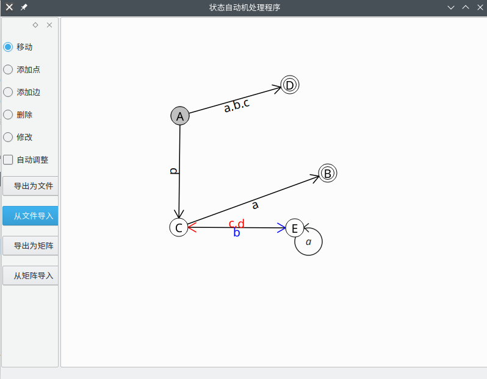

#### 测试用例3

测试目的：测试自动机状态图与矩阵形式的转换

使用测试用例2的数据，点击侧边栏“导出为矩阵”，结果如下

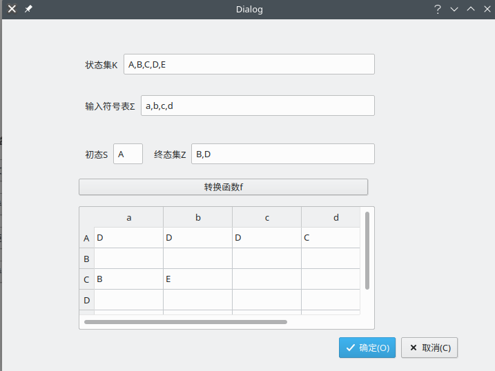

删除所有数据后，点击“从矩阵导入”，按提示填写内容如下：

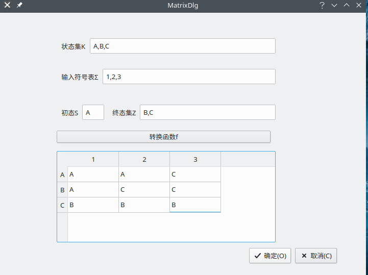

点击确定后绘图如下，座标随机生成

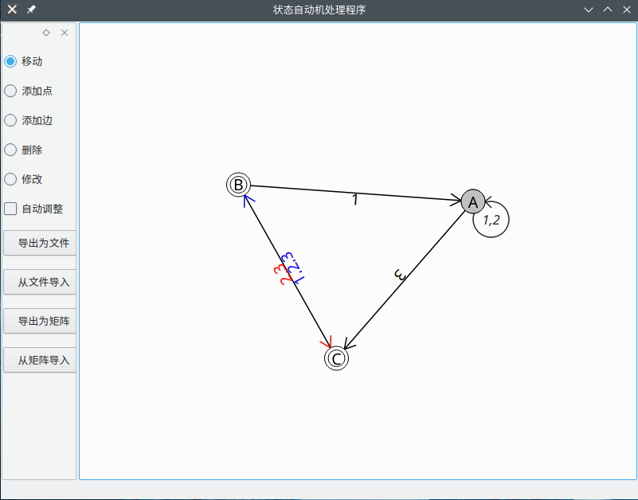

#### 测试用例4

测试目的：杂项

使用测试样例1的方法再画一个

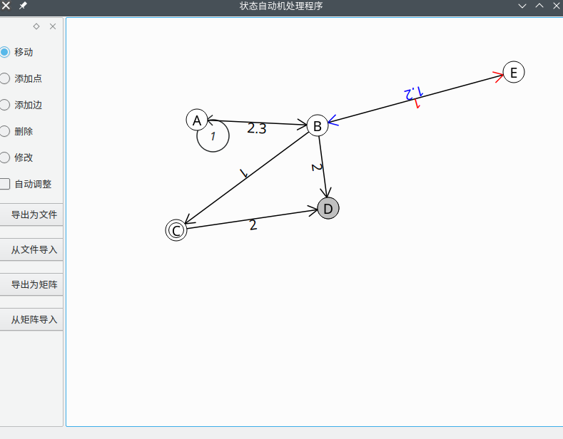

按几次’-’键缩小

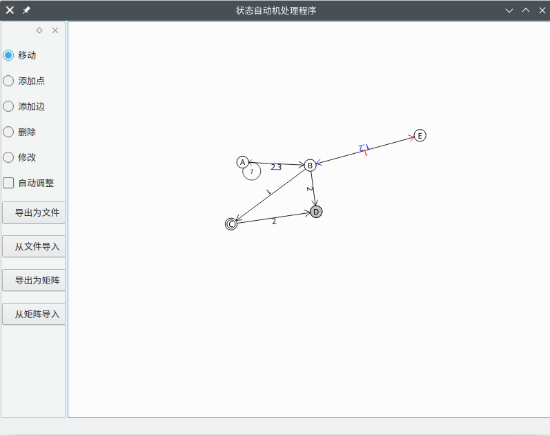

按几次’+’键或’=’键放大

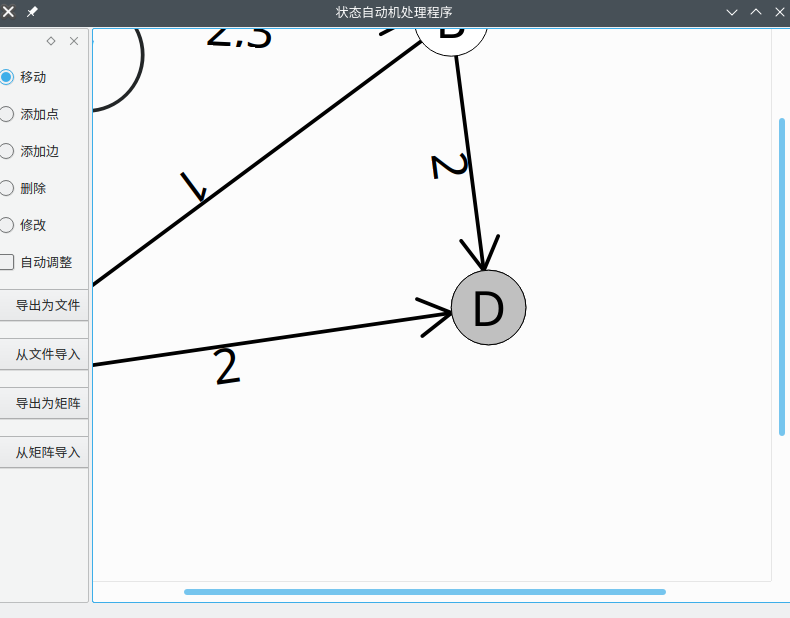

按空格，随机生成所有点的位置

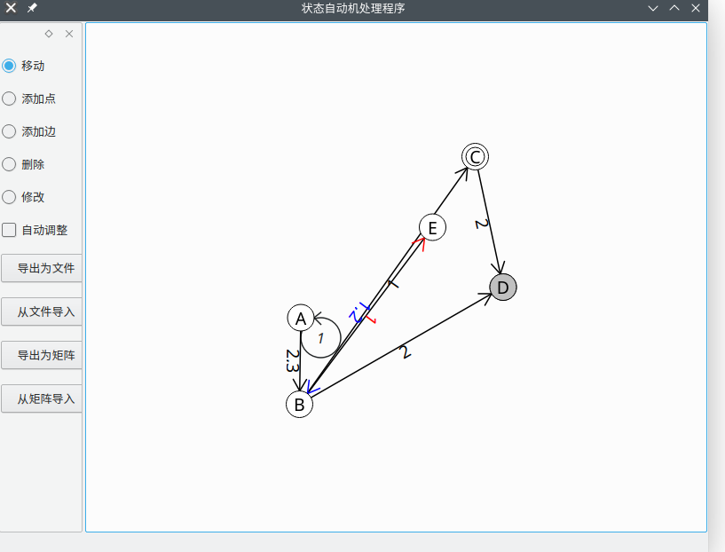

开启自动调整

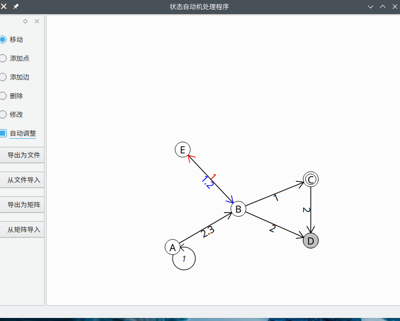

### 参考资料
- [力导向图](https://zh.wikipedia.org/wiki/%E5%8A%9B%E5%AF%BC%E5%90%91%E5%9B%BE)
- [Elastic Nodes Example | Qt Widgets 5.15.6 - Qt Documentation](https://doc.qt.io/qt-5/qtwidgets-graphicsview-elasticnodes-example.html)

## License

